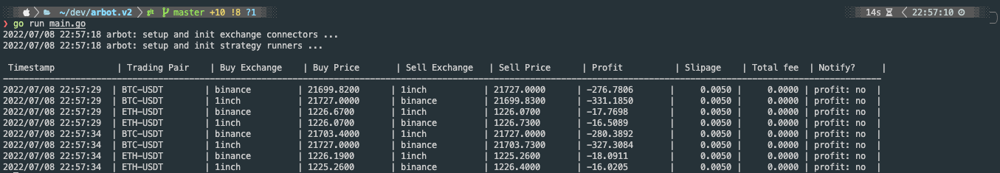

# Taxi Simulator API

Arbitrage bot for simple Cefi-Defi live arbitrage opportunity detection tool.

[](#)

# Table of contents

- [Getting Started](#getting-started)
- [Setup and Install](./docs/SETUP.md)

## Getting Started

### Run Tests

You can invoke `Makefile` command to run all unit tests for you:

```bash
make test
```

If you prefer, you can also run it using golang testing tool:

```bash
go test ./... -short
```

### Run Server

1. Start the server as follows:
   ```bash
   cd arbot
   make run-server
   ```
   Optionally, you can also invoke golang compiler tool to run.
   ```bash
   go run main.go
   ```
2. Once finished, you can stop the server.
   ```bash
   make stop-server
   ```

#### Pre-requisites

- Golang 1.18
- [Go mock](https://github.com/golang/mock) tools >= v1.6.0; optional

Optionally or if you are a developer. You might also want to have:

- OpenAPI / Swagger - interactive test client setup
- Docker / Docker compose

## Setup and Install

- [Developer machine setup](./docs/SETUP.md)
